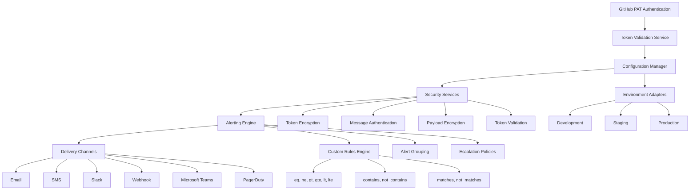

# bolt-diy-to-github

An advanced TypeScript library for authenticating with GitHub using Personal Access Tokens (PATs) with enhanced configuration management and alerting capabilities.

## Features

- **Token Validation**: Validates GitHub PAT format using regex
- **GitHub API Authentication**: Authenticates with GitHub API using PATs
- **Comprehensive Error Handling**: Detailed error messages for troubleshooting
- **TypeScript Support**: Full type safety with TypeScript interfaces
- **London School TDD**: Implementation following Test-Driven Development principles
- **Comprehensive Test Coverage**: Extensive test suite with edge cases
- **Enhanced Configuration Management**: Advanced configuration handling with validation and security
- **Multi-Channel Alerting System**: Email, SMS, Slack, Webhook, Teams, and PagerDuty delivery
- **Custom Alert Rules**: Configurable alert conditions with various operators
- **Alert Grouping and Deduplication**: Intelligent grouping of related alerts
- **Escalation Policies**: Configurable escalation chains with time-based delays
- **Security and Verification**: Token encryption, validation, and prototype pollution protection
- **Environment Configuration Management**: Comprehensive environment-specific configurations

## Architecture



## Installation

```bash
npm install bolt-diy-to-github
```

## Enhanced Usage

### Basic Authentication

```typescript
import { GitHubPATAuthService } from 'bolt-diy-to-github';

const authService = new GitHubPATAuthService();

// Validate a token format
const isValid = authService.validateToken('ghp_your_token_here');

// Authenticate with GitHub
const result = await authService.authenticate('ghp_your_token_here');

if (result.authenticated) {
  console.log('Authentication successful:', result.user);
} else {
  console.error('Authentication failed:', result.error);
}
```

### Advanced Configuration Management

```typescript
import { EnvironmentConfigurationService } from 'bolt-diy-to-github';

const configService = new EnvironmentConfigurationService(
  payloadEncryptionService,
  messageAuthenticationService,
  tokenEncryptionService,
  'encryption-password'
);

// Initialize with environment options
await configService.initialize({
  environment: 'production',
  enableCache: true,
  cacheTTL: 30000
});

// Get configuration values
const apiKey = configService.get('api.key');
const dbHost = configService.get('database.host', 'localhost');
```

### Enhanced Alerting System

```typescript
import { EnhancedConfigurationAlertingService } from 'bolt-diy-to-github';

const alertService = new EnhancedConfigurationAlertingService({
  email: {
    host: 'smtp.example.com',
    port: 587,
    auth: {
      user: 'alerts@example.com',
      pass: 'password'
    }
  },
  slack: {
    webhookUrl: 'https://hooks.slack.com/services/...',
    channel: '#alerts'
  }
});

// Define custom alert rules
const customRules = [
  {
    name: 'config_drift_detection',
    condition: {
      key: 'database.connection',
      operator: 'ne',
      value: 'expected_value'
    },
    severity: 'high',
    description: 'Database connection string has changed'
  }
];

// Send alerts with multiple delivery mechanisms
await alertService.sendAlert({
  type: 'configuration_change',
  message: 'Configuration drift detected',
  severity: 'high',
  metadata: {
    expectedValue: 'expected_value',
    actualValue: 'actual_value'
  },
  deliveryConfig: {
    channels: ['email', 'slack'],
    recipients: {
      email: ['admin@example.com'],
      slack: ['#alerts']
    }
  }
});
```

### Custom Alert Rule Configuration

```typescript
// Define complex alert rules with multiple conditions
const complexRule = {
  name: 'security_violation',
  condition: {
    operator: 'and',
    conditions: [
      {
        key: 'security.encryption_enabled',
        operator: 'eq',
        value: true
      },
      {
        key: 'security.encryption_algorithm',
        operator: 'matches',
        value: '^(aes-256|rsa-2048)'
      }
    ]
  },
  severity: 'critical',
  description: 'Security configuration violation detected'
};
```

## API

### GitHubPATAuthService

#### `validateToken(token: string): boolean`

Validates the format of a GitHub Personal Access Token.

- **token**: The token to validate
- **Returns**: `true` if the token format is valid, `false` otherwise

#### `authenticate(token: string): Promise<AuthResult>`

Authenticates with GitHub API using a Personal Access Token.

- **token**: The GitHub PAT to use for authentication
- **Returns**: A promise that resolves to an `AuthResult` object

### EnhancedConfigurationAlertingService

#### `sendAlert(alert: EnhancedAlertConfig): Promise<AlertResult>`

Sends an enhanced alert with multiple delivery options.

- **alert**: Configuration object for the alert
- **Returns**: Promise with alert result

#### `addCustomRule(rule: CustomAlertRule): void`

Adds a custom alert rule to the system.

- **rule**: Custom alert rule configuration
- **Returns**: void

#### `setEscalationPolicy(policy: EscalationPolicy): void`

Sets escalation policy for alerts.

- **policy**: Escalation policy configuration
- **Returns**: void

### EnvironmentConfigurationService

#### `get(key: string, defaultValue?: any): any`

Gets a configuration value by key.

- **key**: Configuration key path
- **defaultValue**: Default value if key doesn't exist
- **Returns**: Configuration value

#### `set(key: string, value: any): void`

Sets a configuration value.

- **key**: Configuration key path
- **value**: Value to set
- **Returns**: void

#### `initialize(options: ConfigOptions): Promise<void>`

Initializes the configuration service.

- **options**: Initialization options
- **Returns**: Promise that resolves when initialized

## Configuration Options

### Alert Configuration

```typescript
{
  email: {
    host: string,
    port: number,
    secure: boolean,
    auth: {
      user: string,
      pass: string
    }
  },
  slack: {
    webhookUrl: string,
    channel: string,
    username: string
  },
  sms: {
    twilio: {
      accountSid: string,
      authToken: string,
      from: string
    }
  },
  webhook: {
    url: string,
    headers: object
  },
  teams: {
    webhookUrl: string
  },
  pagerduty: {
    integrationKey: string
  }
}
```

### Environment Configuration

```typescript
{
  environment: 'development' | 'staging' | 'production',
  enableCache: boolean,
  cacheTTL: number,
  sources: string[],
  validation: boolean
}
```

## Development

### Building

```bash
npm run build
```

### Testing

```bash
# Run all tests
npm test

# Run tests with coverage
npm test -- --coverage

# Run specific test file
npm test -- src/services/__tests__/githubAuth.london.tdd.test.ts

# Run enhanced alerting tests
npm test -- src/monitoring/__tests__/EnhancedConfigurationAlertingService.test.ts
```

### Type Checking

```bash
npm run typecheck
```

## Enhanced Features

### Multi-Channel Delivery
- **Email**: SMTP-based email delivery with customizable templates
- **SMS**: Twilio integration for SMS notifications
- **Slack**: Webhook-based Slack messaging
- **Webhook**: Custom webhook endpoints
- **Microsoft Teams**: Teams connector integration
- **PagerDuty**: Incident management integration

### Custom Alert Rules
- **eq**: Equal to
- **ne**: Not equal to
- **gt**: Greater than
- **gte**: Greater than or equal to
- **lt**: Less than
- **lte**: Less than or equal to
- **contains**: Contains substring
- **not_contains**: Does not contain substring
- **matches**: Matches regex pattern
- **not_matches**: Does not match regex pattern

### Alert Grouping and Deduplication
- Time-based grouping windows
- Similarity detection algorithms
- Duplicate suppression mechanisms
- Intelligent grouping by common attributes

### Escalation Policies
- Configurable escalation chains
- Time-based delays
- Multiple escalation steps
- Priority-based routing

## Security Features

- **Token Encryption**: AES-256 encryption for sensitive tokens
- **Message Authentication**: HMAC-SHA256 for message integrity
- **Configuration Validation**: Comprehensive validation frameworks
- **Prototype Pollution Protection**: Secure configuration parsing
- **Environment Isolation**: Separate configuration spaces per environment

## London School TDD Approach

This implementation follows the London School Test-Driven Development methodology:

1. **Outside-In Development**: Tests are written from the consumer's perspective
2. **Mock-First Approach**: External dependencies are mocked to isolate units
3. **Interaction Testing**: Focus on behavior and interactions rather than implementation details

## Test Coverage

The test suite includes comprehensive coverage for:

- Token validation with various input scenarios
- Authentication flow with mock API responses
- Configuration management with validation
- Alerting system with multiple delivery channels
- Environment-specific configurations
- Security protocols and encryption
- Error handling for different failure modes
- Edge cases and boundary conditions
- Integration points with external services

## Production Deployment

### Environment Configuration
Ensure proper environment variables are set:
- `ENCRYPTION_PASSWORD`: Password for token encryption
- `SMTP_HOST`: Email server host
- `SLACK_WEBHOOK_URL`: Slack webhook URL
- `TWILIO_ACCOUNT_SID`: Twilio account SID
- `TWILIO_AUTH_TOKEN`: Twilio auth token

### Performance Considerations
- Configure appropriate cache TTL values
- Set up proper alert grouping windows
- Optimize escalation policies for response times
- Monitor system resource usage

## License

ISC