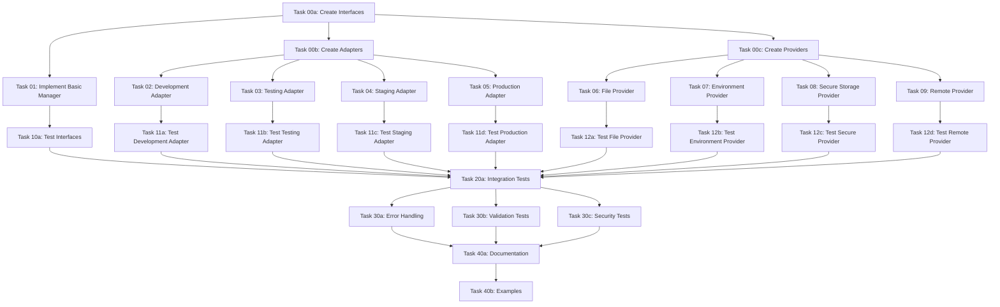

# Phase 1: Core Implementation - Task Sequence

## Overview

This document outlines the detailed task sequence for Phase 1 of the Environment Configuration Management system implementation. The phase focuses on implementing the fundamental configuration management system with basic adapters and providers as specified in the master plan.

## Phase Objectives

1. **Core System Components**: Implement ConfigurationManager interface and BasicConfigurationManager
2. **Environment Adapters**: Create adapters for all environment types (development, testing, staging, production)
3. **Configuration Providers**: Implement providers for all configuration sources (file, environment, secure storage, remote)
4. **Basic Functionality**: Ensure configuration loading, validation, and retrieval work correctly
5. **Integration Testing**: Validate all components work together seamlessly

## Task Dependencies

## Detailed Task Sequence

### Foundation Tasks (Days 1-2)

#### Task 00a: Create Core Interfaces
**Duration**: 4 hours
**Description**: Define all core interfaces for the configuration management system
**Deliverables**:
- ConfigurationManager.ts
- EnvironmentAdapter.ts
- ConfigurationProvider.ts
- Supporting type definitions

**Acceptance Criteria**:
- [ ] All interfaces properly defined with JSDoc
- [ ] Generic types used appropriately
- [ ] Method signatures consistent
- [ ] Type safety ensured
- [ ] Peer review completed

#### Task 00b: Create Environment Adapters
**Duration**: 3 hours
**Description**: Define interfaces and base classes for environment adapters
**Deliverables**:
- EnvironmentAdapter interface
- DevelopmentEnvironmentAdapter base implementation
- TestingEnvironmentAdapter base implementation
- StagingEnvironmentAdapter base implementation
- ProductionEnvironmentAdapter base implementation

**Acceptance Criteria**:
- [ ] EnvironmentAdapter interface complete
- [ ] All environment adapters defined
- [ ] Environment type enumeration created
- [ ] Base implementations scaffolded
- [ ] Peer review completed

#### Task 00c: Create Configuration Providers
**Duration**: 3 hours
**Description**: Define interfaces and base classes for configuration providers
**Deliverables**:
- ConfigurationProvider interface
- FileConfigurationProvider base implementation
- EnvironmentConfigurationProvider base implementation
- SecureStorageConfigurationProvider base implementation
- RemoteConfigurationProvider base implementation

**Acceptance Criteria**:
- [ ] ConfigurationProvider interface complete
- [ ] All provider interfaces defined
- [ ] Configuration source enumeration created
- [ ] Base implementations scaffolded
- [ ] Peer review completed

### Core Implementation Tasks (Days 3-5)

#### Task 01: Implement Basic ConfigurationManager
**Duration**: 8 hours
**Description**: Implement the core configuration manager with caching and change notification
**Dependencies**: Task 00a
**Deliverables**:
- BasicConfigurationManager.ts
- Configuration caching implementation
- Change notification system
- Status reporting functionality

**Acceptance Criteria**:
- [ ] ConfigurationManager interface fully implemented
- [ ] Configuration loading from multiple sources
- [ ] Nested object retrieval with dot notation
- [ ] Configuration setting with change notifications
- [ ] Cache management with TTL support
- [ ] Hot reloading functionality
- [ ] Status reporting capabilities
- [ ] Unit tests pass (100% coverage)
- [ ] Peer review completed

#### Task 02: Implement Development Environment Adapter
**Duration**: 4 hours
**Description**: Implement development-specific configuration adapter
**Dependencies**: Task 00b
**Deliverables**:
- DevelopmentEnvironmentAdapter.ts
- Development configuration sources
- Debug mode enablement
- Hot reloading support

**Acceptance Criteria**:
- [ ] DevelopmentEnvironmentAdapter fully implemented
- [ ] File-based configuration sources
- [ ] Environment variable sources
- [ ] Debug mode configuration
- [ ] Hot reloading configuration
- [ ] Development API endpoints
- [ ] Permissive validation for development
- [ ] Unit tests pass (100% coverage)
- [ ] Peer review completed

#### Task 03: Implement Testing Environment Adapter
**Duration**: 4 hours
**Description**: Implement testing-specific configuration adapter
**Dependencies**: Task 00b
**Deliverables**:
- TestingEnvironmentAdapter.ts
- Testing configuration sources
- Test data isolation
- Mocking capabilities

**Acceptance Criteria**:
- [ ] TestingEnvironmentAdapter fully implemented
- [ ] Testing-specific configuration sources
- [ ] Test environment validation
- [ ] Mock configuration support
- [ ] Test data separation
- [ ] Unit tests pass (100% coverage)
- [ ] Peer review completed

#### Task 04: Implement Staging Environment Adapter
**Duration**: 4 hours
**Description**: Implement staging-specific configuration adapter
**Dependencies**: Task 00b
**Deliverables**:
- StagingEnvironmentAdapter.ts
- Staging configuration sources
- Pre-production validation
- Monitoring integration

**Acceptance Criteria**:
- [ ] StagingEnvironmentAdapter fully implemented
- [ ] Staging configuration sources
- [ ] Pre-production validation rules
- [ ] Monitoring hooks integration
- [ ] Environment transformation support
- [ ] Unit tests pass (100% coverage)
- [ ] Peer review completed

#### Task 05: Implement Production Environment Adapter
**Duration**: 6 hours
**Description**: Implement production-specific configuration adapter
**Dependencies**: Task 00b
**Deliverables**:
- ProductionEnvironmentAdapter.ts
- Production configuration sources
- Security hardening
- Performance optimization

**Acceptance Criteria**:
- [ ] ProductionEnvironmentAdapter fully implemented
- [ ] Production security measures
- [ ] Performance optimizations
- [ ] Strict validation rules
- [ ] Secure default configurations
- [ ] Unit tests pass (100% coverage)
- [ ] Peer review completed

#### Task 06: Implement File Configuration Provider
**Duration**: 6 hours
**Description**: Implement file-based configuration provider
**Dependencies**: Task 00c
**Deliverables**:
- FileConfigurationProvider.ts
- JSON file support
- YAML file support
- File change detection

**Acceptance Criteria**:
- [ ] FileConfigurationProvider fully implemented
- [ ] JSON file loading and parsing
- [ ] YAML file loading and parsing
- [ ] File change detection
- [ ] Error handling for missing files
- [ ] Directory creation for saving
- [ ] Format validation
- [ ] Unit tests pass (100% coverage)
- [ ] Peer review completed

#### Task 07: Implement Environment Configuration Provider
**Duration**: 4 hours
**Description**: Implement environment variable configuration provider
**Dependencies**: Task 00c
**Deliverables**:
- EnvironmentConfigurationProvider.ts
- Environment variable parsing
- Prefix filtering
- Type conversion

**Acceptance Criteria**:
- [ ] EnvironmentConfigurationProvider fully implemented
- [ ] Environment variable parsing
- [ ] Prefix filtering support
- [ ] Type conversion (string to boolean/number)
- [ ] Nested variable support
- [ ] Default value handling
- [ ] Unit tests pass (100% coverage)
- [ ] Peer review completed

#### Task 08: Implement Secure Storage Configuration Provider
**Duration**: 8 hours
**Description**: Implement secure storage configuration provider with encryption
**Dependencies**: Task 00c
**Deliverables**:
- SecureStorageConfigurationProvider.ts
- Encryption service integration
- Authentication service integration
- Secure storage mechanisms

**Acceptance Criteria**:
- [ ] SecureStorageConfigurationProvider fully implemented
- [ ] Encryption service integration
- [ ] Authentication service integration
- [ ] Secure storage mechanisms
- [ ] Access control implementation
- [ ] Audit logging
- [ ] Unit tests pass (100% coverage)
- [ ] Peer review completed

#### Task 09: Implement Remote Configuration Provider
**Duration**: 6 hours
**Description**: Implement remote configuration provider
**Dependencies**: Task 00c
**Deliverables**:
- RemoteConfigurationProvider.ts
- HTTP/HTTPS client
- Authentication support
- Caching with TTL

**Acceptance Criteria**:
- [ ] RemoteConfigurationProvider fully implemented
- [ ] HTTP/HTTPS client implementation
- [ ] Authentication header support
- [ ] Timeout handling
- [ ] Retry logic
- [ ] Caching with TTL
- [ ] Error handling
- [ ] Unit tests pass (100% coverage)
- [ ] Peer review completed

### Testing and Validation Tasks (Days 6-8)

#### Task 10a: Test Core Interfaces
**Duration**: 3 hours
**Description**: Comprehensive testing of core interfaces
**Dependencies**: Task 00a
**Deliverables**:
- Interface unit tests
- Integration tests for interfaces
- Mock implementations for testing

**Acceptance Criteria**:
- [ ] All interfaces have unit tests
- [ ] Interface contracts validated
- [ ] Mock implementations created
- [ ] 100% test coverage for interfaces
- [ ] Test documentation complete

#### Task 10b: Test Environment Adapters
**Duration**: 2 hours
**Description**: Comprehensive testing of environment adapter interfaces
**Dependencies**: Task 00b
**Deliverables**:
- Adapter interface unit tests
- Integration tests for adapter interfaces
- Mock adapters for testing

**Acceptance Criteria**:
- [ ] All adapter interfaces have unit tests
- [ ] Adapter contracts validated
- [ ] Mock adapters created
- [ ] 100% test coverage for adapter interfaces
- [ ] Test documentation complete

#### Task 10c: Test Configuration Providers
**Duration**: 2 hours
**Description**: Comprehensive testing of configuration provider interfaces
**Dependencies**: Task 00c
**Deliverables**:
- Provider interface unit tests
- Integration tests for provider interfaces
- Mock providers for testing

**Acceptance Criteria**:
- [ ] All provider interfaces have unit tests
- [ ] Provider contracts validated
- [ ] Mock providers created
- [ ] 100% test coverage for provider interfaces
- [ ] Test documentation complete

#### Task 11a: Test Development Environment Adapter
**Duration**: 3 hours
**Description**: Comprehensive testing of development environment adapter
**Dependencies**: Task 02
**Deliverables**:
- Development adapter unit tests
- Integration tests with configuration manager
- Performance tests

**Acceptance Criteria**:
- [ ] Development adapter unit tests pass
- [ ] Integration with configuration manager
- [ ] Performance benchmarks met
- [ ] 100% test coverage
- [ ] Test documentation complete

#### Task 11b: Test Testing Environment Adapter
**Duration**: 3 hours
**Description**: Comprehensive testing of testing environment adapter
**Dependencies**: Task 03
**Deliverables**:
- Testing adapter unit tests
- Integration tests with configuration manager
- Mock integration tests

**Acceptance Criteria**:
- [ ] Testing adapter unit tests pass
- [ ] Integration with configuration manager
- [ ] Mock integration validated
- [ ] 100% test coverage
- [ ] Test documentation complete

#### Task 11c: Test Staging Environment Adapter
**Duration**: 3 hours
**Description**: Comprehensive testing of staging environment adapter
**Dependencies**: Task 04
**Deliverables**:
- Staging adapter unit tests
- Integration tests with configuration manager
- Validation tests

**Acceptance Criteria**:
- [ ] Staging adapter unit tests pass
- [ ] Integration with configuration manager
- [ ] Validation rules tested
- [ ] 100% test coverage
- [ ] Test documentation complete

#### Task 11d: Test Production Environment Adapter
**Duration**: 4 hours
**Description**: Comprehensive testing of production environment adapter
**Dependencies**: Task 05
**Deliverables**:
- Production adapter unit tests
- Integration tests with configuration manager
- Security tests
- Performance tests

**Acceptance Criteria**:
- [ ] Production adapter unit tests pass
- [ ] Integration with configuration manager
- [ ] Security requirements validated
- [ ] Performance benchmarks met
- [ ] 100% test coverage
- [ ] Test documentation complete

#### Task 12a: Test File Configuration Provider
**Duration**: 4 hours
**Description**: Comprehensive testing of file configuration provider
**Dependencies**: Task 06
**Deliverables**:
- File provider unit tests
- Integration tests with configuration manager
- File format tests
- Error handling tests

**Acceptance Criteria**:
- [ ] File provider unit tests pass
- [ ] Integration with configuration manager
- [ ] JSON and YAML format support
- [ ] Error handling validated
- [ ] 100% test coverage
- [ ] Test documentation complete

#### Task 12b: Test Environment Configuration Provider
**Duration**: 3 hours
**Description**: Comprehensive testing of environment configuration provider
**Dependencies**: Task 07
**Deliverables**:
- Environment provider unit tests
- Integration tests with configuration manager
- Type conversion tests
- Prefix filtering tests

**Acceptance Criteria**:
- [ ] Environment provider unit tests pass
- [ ] Integration with configuration manager
- [ ] Type conversion validated
- [ ] Prefix filtering works correctly
- [ ] 100% test coverage
- [ ] Test documentation complete

#### Task 12c: Test Secure Storage Configuration Provider
**Duration**: 5 hours
**Description**: Comprehensive testing of secure storage configuration provider
**Dependencies**: Task 08
**Deliverables**:
- Secure provider unit tests
- Integration tests with configuration manager
- Encryption tests
- Security tests
- Access control tests

**Acceptance Criteria**:
- [ ] Secure provider unit tests pass
- [ ] Integration with configuration manager
- [ ] Encryption/decryption validated
- [ ] Security requirements met
- [ ] Access control working
- [ ] 100% test coverage
- [ ] Test documentation complete

#### Task 12d: Test Remote Configuration Provider
**Duration**: 4 hours
**Description**: Comprehensive testing of remote configuration provider
**Dependencies**: Task 09
**Deliverables**:
- Remote provider unit tests
- Integration tests with configuration manager
- Network error tests
- Authentication tests
- Caching tests

**Acceptance Criteria**:
- [ ] Remote provider unit tests pass
- [ ] Integration with configuration manager
- [ ] Network error handling validated
- [ ] Authentication working
- [ ] Caching functionality tested
- [ ] 100% test coverage
- [ ] Test documentation complete

### Integration and System Testing Tasks (Days 9-10)

#### Task 20a: Integration Tests
**Duration**: 6 hours
**Description**: Comprehensive integration testing of all components
**Dependencies**: All implementation tasks
**Deliverables**:
- Multi-provider integration tests
- Environment adapter integration tests
- End-to-end configuration flow tests
- Performance integration tests

**Acceptance Criteria**:
- [ ] All components integrate correctly
- [ ] Multi-provider configuration merging
- [ ] Environment-specific behavior validated
- [ ] End-to-end flows working
- [ ] Performance requirements met
- [ ] Integration test documentation

#### Task 30a: Error Handling Tests
**Duration**: 4 hours
**Description**: Comprehensive error handling testing
**Dependencies**: All implementation tasks
**Deliverables**:
- Error handling unit tests
- Integration error tests
- Recovery tests
- Logging tests

**Acceptance Criteria**:
- [ ] All error scenarios covered
- [ ] Graceful failure recovery
- [ ] Proper error logging
- [ ] User-friendly error messages
- [ ] 100% error handling coverage

#### Task 30b: Configuration Validation Tests
**Duration**: 3 hours
**Description**: Comprehensive configuration validation testing
**Dependencies**: All implementation tasks
**Deliverables**:
- Validation unit tests
- Environment-specific validation tests
- Schema validation tests
- Integration validation tests

**Acceptance Criteria**:
- [ ] All validation rules tested
- [ ] Environment-specific validation
- [ ] Schema validation working
- [ ] Integration validation passes
- [ ] 100% validation coverage

#### Task 30c: Security Tests
**Duration**: 5 hours
**Description**: Comprehensive security testing
**Dependencies**: All implementation tasks
**Deliverables**:
- Security unit tests
- Penetration tests
- Vulnerability scans
- Compliance tests

**Acceptance Criteria**:
- [ ] All security requirements met
- [ ] No critical vulnerabilities
- [ ] Encryption validated
- [ ] Access control working
- [ ] Compliance verified

### Documentation and Examples Tasks (Days 11-12)

#### Task 40a: Documentation
**Duration**: 6 hours
**Description**: Create comprehensive documentation for all implemented components
**Dependencies**: All implementation tasks
**Deliverables**:
- API documentation
- Usage guides
- Configuration examples
- Best practices documentation

**Acceptance Criteria**:
- [ ] All public APIs documented
- [ ] Usage examples provided
- [ ] Configuration guides complete
- [ ] Best practices documented
- [ ] Documentation peer reviewed

#### Task 40b: Examples
**Duration**: 4 hours
**Description**: Create comprehensive examples for all use cases
**Dependencies**: All implementation tasks
**Deliverables**:
- Basic usage examples
- Multi-environment examples
- Secure storage examples
- Remote configuration examples

**Acceptance Criteria**:
- [ ] Basic usage examples working
- [ ] Multi-environment examples complete
- [ ] Secure storage examples functional
- [ ] Remote configuration examples working
- [ ] Examples peer reviewed

## Resource Allocation

### Team Members
- **Lead Developer**: 40% allocation
- **Senior Developer**: 30% allocation
- **Junior Developer**: 20% allocation
- **QA Engineer**: 10% allocation

### Tools and Infrastructure
- **Development Environment**: TypeScript, Node.js
- **Testing Framework**: Jest
- **CI/CD**: GitHub Actions
- **Documentation**: Markdown, Mermaid
- **Security Testing**: OWASP ZAP, Snyk

## Timeline

### Week 1: Foundation and Core Implementation
- **Days 1-2**: Interface and base class creation
- **Days 3-5**: Core implementation

### Week 2: Testing and Validation
- **Days 6-8**: Component testing
- **Days 9-10**: Integration and system testing

### Week 3: Documentation and Examples
- **Days 11-12**: Documentation and examples

## Success Criteria

### Functional Success Criteria
- [ ] All core configuration management features working
- [ ] Environment-specific configuration loading
- [ ] Secure configuration storage
- [ ] Dynamic configuration reloading
- [ ] Comprehensive validation

### Quality Success Criteria
- [ ] 100% test coverage
- [ ] 0 critical security vulnerabilities
- [ ] Truth verification score ≥ 0.95
- [ ] Performance benchmarks met
- [ ] Documentation complete

### Delivery Success Criteria
- [ ] All tasks completed on schedule
- [ ] All deliverables accepted
- [ ] No critical bugs in production
- [ ] User satisfaction ≥ 4.5/5.0
- [ ] Team satisfaction ≥ 4.0/5.0

## Risk Management

### Identified Risks
1. **Technical Complexity**: High complexity of security integration
   - **Mitigation**: Allocate senior developer resources
   - **Contingency**: Extend timeline by 2 days if needed

2. **Integration Issues**: Potential issues with existing services
   - **Mitigation**: Early integration testing
   - **Contingency**: Allocate additional 3 days for fixes

3. **Performance Requirements**: Meeting strict performance benchmarks
   - **Mitigation**: Continuous performance monitoring
   - **Contingency**: Performance optimization sprint

4. **Security Compliance**: Meeting security standards
   - **Mitigation**: Regular security reviews
   - **Contingency**: Additional security testing phase

## Approval

**Project Manager**: ___________________ **Date**: _______________
**Technical Lead**: ___________________ **Date**: _______________
**Team Lead**: ___________________ **Date**: _______________

This task sequence provides a comprehensive roadmap for Phase 1 implementation with clear dependencies, timelines, and success criteria.